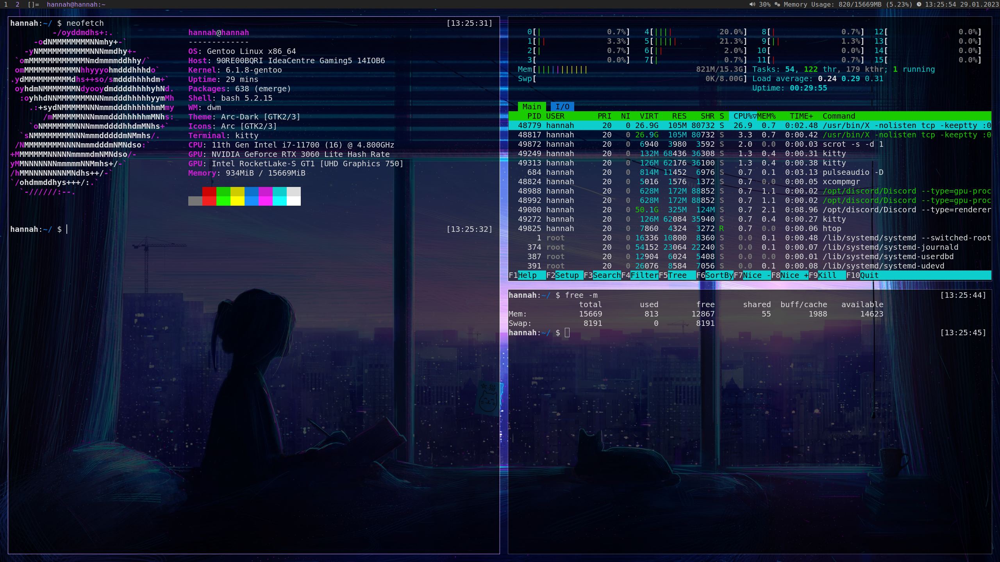

<p align="center">PS: This is the kitty terminal not ST</p>
<br>

https://github.com/hnhx/suckless <-- the original creator of this

Make sure to install the required packages from the file named "arch-package-list" (arch only)

How to install:

```
git clone https://github.com/opensky0/suckless.git
cd suckless
sudo pacman -S $(cat arch-package-list)  # only if you are on a arch based system
make
sudo make install
```
CHECK "Variant2" BRANCH FOR UPDATED VERSION
