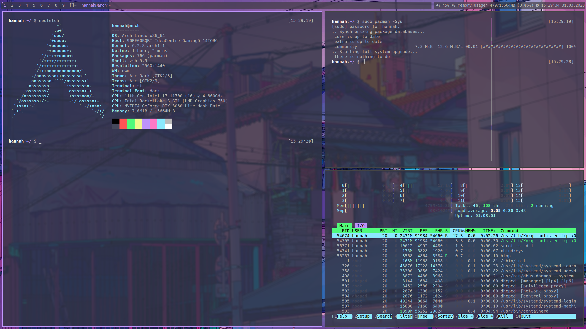

<p align="center">Hnhx's simple suckless rice</p>

<br>

How to install:

```
git clone https://github.com/opensky0/rice.git
cd rice
make
sudo make install
```

The packages you will need: `ttf-liberation ttf-dejavu xorg-xsetroot nitrogen ttf-font-awesome xorg-xinit xbindkeys dunst pulseaudio`
